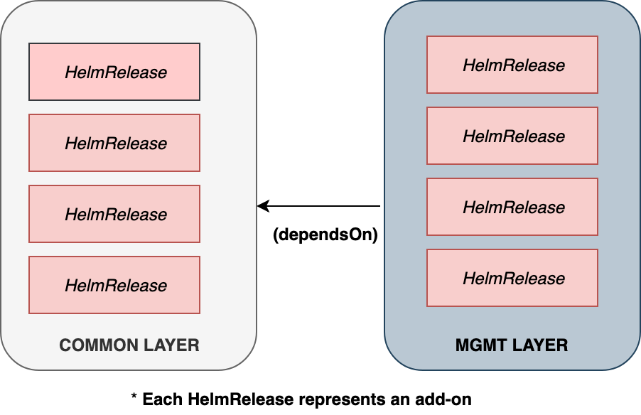

# Design
Kraan is a kubernetes controller for processing "AddonLayer" custom resources.
An AddonLayer has the following features.
* Represents a collection of add-ons, managed as [HelmRelease](https://docs.fluxcd.io/projects/helm-operator/en/stable/helmrelease-guide/introduction/#a-minimal-helmrelease)
  custom resources.   
* AddonLayer is a cluster scoped custom resource (non-namespaced).
* Certify layers on specific k8s version. i.e All the add-ons in a layer is guaranteed
  to work without issues on a specified k8s version. Kraan will attempt to deploy
  a layer only when the cluster is at a specified version.
* Establish dependency between layers.
* Pause/Resume layer processing.

### Components
Kraan is a combination of 3 tools. The installation of kraan will involve the 
installation of all these 3 tools.
* kraan controller
* [source-controller](https://github.com/fluxcd/source-controller)
* [helm-operator](https://github.com/fluxcd/helm-operator)



kraan controller is the main controller that is responsible to watching AddonLayer
custom resources and bringing to its desired state. In attempting to do so, it 
relies on helm-operator to deploy the addon helm charts that are part of the layer. Helm operator watches
and reconciles *HelmRelease* custom resource. Each *HelmRelease* custom resources
represents a single addon. For more details on *HelmRelease*, check 
[here](https://docs.fluxcd.io/projects/helm-operator/en/stable/helmrelease-guide/introduction/).
source-controller is one of the components in [gitops-toolkit](https://toolkit.fluxcd.io/) which 
helps abstracting away git interaction from kraan. By design, an AddonLayer will
point to a *directory in a git repository* which contains the list of
HelmReleases. Whenever kraans' reconciliation logic is kicked off, in order to
fetch the list of helm releases that are part of that addon layer, it will reach out
to source-controller api to fetch repo files instead of reaching out to git directly. 


***Note:*** *In future, kraan will support packaging addons in formats other 
than helm charts e.g kustomization*
 
### Spec
The addons are first packaged as HelmRelease custom resources which represents
a helm chart. A sample helm release custom resource is shown below.
For more details on *HelmRelease*, check
[here](https://docs.fluxcd.io/projects/helm-operator/en/stable/helmrelease-guide/introduction/).


```yaml
# podinfo.yaml
---
apiVersion: helm.fluxcd.io/v1
kind: HelmRelease
metadata:
  name: podinfo
  namespace: default
spec:
  chart:
    repository: https://stefanprodan.github.io/podinfo
    name: podinfo
    version: 3.2.0
```

###### Example
A sample addon layer custom resource is shown below. 
```yaml
apiVersion: kraan.io/v1alpha1
kind: AddonsLayer
metadata:
  name: bootstrap

spec:
  version: 1.0.0
  hold: true
  interval: 1m
  source:
    name: addons
    namespace: gotk-system
    path: ./addons/bootstrap
  prereqs:
      k8sVersion: "1.16"
---
apiVersion: kraan.io/v1alpha1
kind: AddonsLayer
metadata:
  name: base

spec:
  version: 1.0.1
  interval: 1m
  source: 
    name: addons
    namespace: gotk-system
    path: ./addons/base
  prereqs:
      k8sVersion: "1.16"
      dependsOn:
        - bootstrap@1.0.0
```

## Reconciliation Logic
Kraan controller is built using the [kubebuilder](https://github.com/kubernetes-sigs/kubebuilder) project.
From a controllers' perspective, reconciliation is where it attempts to bring the
current state of the layer into its desired state. The reconciliation logic is 
kicked off whenever there is a change detected in the AddonLayer custom resource.
It could be an addition, deletion or an update to the resource. Whenever an event is 
received for an AddonLayer,

* Check whether the version of the Kubernetes API deployed on the cluster is greater than or equal to prereqs.K8sVersion.
  If the cluster is not yet in the expected version, return back without throwing an error. 
  Controllers' periodic sync will trigger the reconcile next time.
* execute a custom prune logic, where any addon that is present in the cluster
  but NOT in the repo will be removed from the cluster. Basically any addon that is 
  not part of the current layer spec is removed from the cluster. Note that removal
  of an addon does not check for dependencies between layers. If the prune is
  not successful, then return an error, which should trigger an exponential
  back off.
* Check if the dependent layers are succesfully deployed. This is a multi step process.
    * The dependent layer is identified by a combination of name and a version.
      i.e base@0.1.2 means that a layer with name "base" and spec.version = 0.1.2 is expected.
    * If the dependent layer isn't found, return nil and requeue the request
      to process after 10 mins.
    * If the layer is found, check whether the status of the layer is set to
      successfully deployed by inspecting the status subresource of that custom
      resource.
    * If the layer is not successfully deployed yet, return to requeue the request
      after 10 mins.    
* If the dependent layer is successfully deployed, then proceed to deploy this layers'
  addons. Return error on failure which will trigger an exponential backoff.

At every stage, the status subresource on the layer custom resource will be 
updated with the latest status.